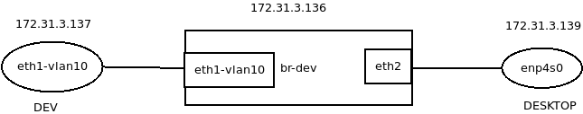

```bash
ip link add link DEVICE name NAME type vlan [ protocol VLAN_PROTO ] id VLANID
[ reorder_hdr { on | off } ]
[ gvrp { on | off } ] [ mvrp { on | off } ]
[ loose_binding { on | off } ]
[ ingress-qos-map QOS-MAP ] [egress-qos-map QOS-MAP ]
```


## 参数说明

| 参数                      | 参数说明                       |
| ------------------------- | ------------------------------ |
| protocol VLAN_PROTO       | 协议类型 `802.1Q` or `802.1ad` |
| id VLANID                 |                                |
| reorder_hdr { on \| off } |                                |
| gvrp { on \| off }        |                                |
| mvrp { on \| off }        |                                |
|                           |                                |


## 应用示例(一) 

配置单独的`vlan` 设备。

```bash
# 配置vlan
ip link add link enp4s0 name enp4s0-vlan-10 type vlan id 10
# 配置ip
ip addr add 172.31.3.139/24 dev enp4s0-vlan-10
# 设备up
ip link set enp4s0-vlan-10 up
```

详细信息参见 `ip-link` manual 手册。


## 应用示例(二)



如上所示：

* 左侧设备配置`eth1-vlan10` ，配置IP地址 `172.31.3.137`
* 中间设备配置`eth1-vlan10`，并将`eth1-vlan10` 、`eth2` 加入到`br-dev` 中，`br-dev`配置IP地址`172.31.3.136`
* 右侧设备`enp4s0` 配置IP地址`172.31.3.139`

配置之后，设备之间可以互通。


