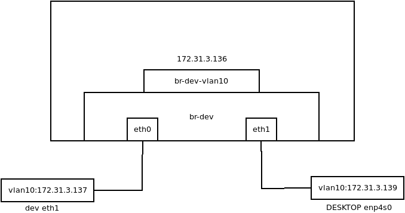

## 配置命令汇总

### ip-link

```bash
# 创建桥
ip link add <bridge-name> type bridge
# 添加桥口
ip link set <eth-name> master <bridge-name>
# 查看桥下设备
ip link show master <bridge-name>
# 删除桥口
ip link set <eth-name> nomaster
# 删除桥设备
ip link del <bridge-name> type bridge
```


### bridge

```bash
bridge vlan {add|del} dev DEV vid VID [tunnel_info TUNNEL_ID] [pvid] [untagged] [self] [master]
```


## 配置案例(一)

### 配置描述




如上图所示，两侧设备加入到`vlan10` 中，配置IP地址分别为`172.31.3.137`，`172.31.3.139`。

两侧设备连到中间设备桥中，中间设备虚拟出一个`vlan`  设备，`IP` 地址为`172.31.3.136`，两侧设备可以互通信，中间设备可以互相通信。

### 配置命令

```bash
# 左侧设备配置
## vlan设备添加
ip link add link eth1 name eth1-vlan10 type vlan id 10
## 设置IP地址
ip addr add 172.31.3.137/24 dev eth1-vlan10 
## 设备up
ip link set eth1 up
ip link set eth1-vlan10 up

# 右侧设备配置
ip link add link enp4s0 name enp4s0-vlan10 type vlan id 10
ip addr add 172.31.3.139/24 dev enp4s0-vlan10
ip link set enp4s0 up
ip link set enp4s0-vlan10 up

# 中间设备配置
## 桥配置
ip link add br-dev type bridge vlan_filtering 1 vlan_default_pvid 1
ip link set dev eth0 master br-dev
ip link set dev eth1 master br-dev
ip link set br-dev up
ip link set eth0 up
ip link set eth1 up
## vlan设备配置
ip link add link br-dev name br-dev-vlan10 type vlan id 10
ip addr add 172.31.3.136/24 dev br-dev-vlan10
ip link set br-dev-vlan10 up
## vlan配置
bridge vlan add dev eth0 vid 10 master
bridge vlan add dev eth1 vid 10 master
bridge vlan add dev br-dev vid 10 self
```


### 总结

如上配置所示，桥起到了过滤功能，可以将桥设备理解成一个到本地的端口，只有将这个端口添加到对应`vlan` ，本地才能收到对应`vlan`的报文；同样的带有`vlan tag` 的报文想要与本机通信，本机必须要有对应`vlan` 的设备。

**Tips：**

* `bridge` 在配置`vlan` 过程中，`master` 、`self` 的使用情景是唯一的。

  配置桥的时候需要加`self` ；配置实际的物理接口的时候需要加`master` ，`master` 可以省略。


## 附录

### 参考资料

* [Linux Bridge vlan filtering](https://segmentfault.com/a/1190000039679169)

