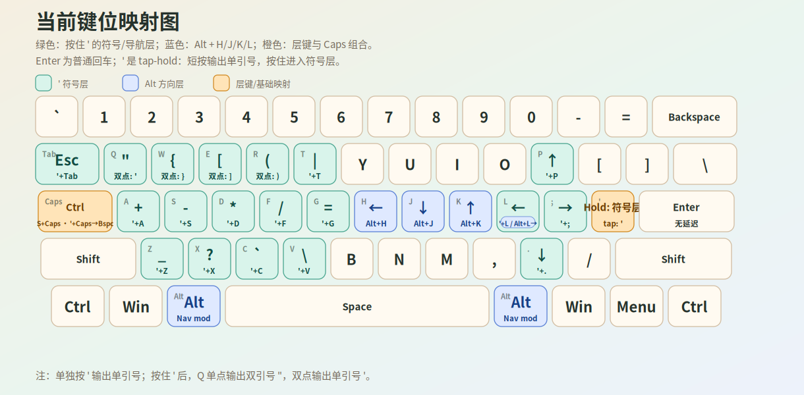

## 键盘映射

| 映射前       | 映射后    | 功能                       |
|--------------|-----------|----------------------------|
| Caps         | Ctrl      |                            |
| Shift + Caps | Caps      | 字母大写                   |
| ' + Caps     | Backspace | 映射成Backspace            |
| ' + Tab      | Esc       | 映射成Esc                  |
| ' + p        |           | 上                         |
| ' + .        |           | 下                         |
| ' + l        |           | 左                         |
| ' + ;        |           | 右                         |
| ' + q        | ' "       | 单点是双引号; 双点是单引号 |
| ' + w        | {}        | 单点是左括号; 双点是右括号 |
| ' + e        | []        | 单点是左括号; 双点是右括号 |
| ' + r        | ()        | 单点是左括号; 双点是右括号 |
| ' + t        | \|        | 竖线                       |
| ' + a        | +         | + 码                       |
| ' + s        | -         | - 号                       |
| ' + d        | *         | * 号                       |
| ' + f        | /         | / 号                       |
| ' + g        | =         | = 号                       |
| ' + z        | _         | 下划线                     |
| ' + c        | `         | ` 号                       |
| ' + x        | ?         | ? 号                       |
| ' + v        | \         | 反斜线                     |
| Alt + k      |           | 上                         |
| Alt + j      |           | 下                         |
| Alt + h      |           | 左                         |
| Alt + l      |           | 右                         |

## 配置文件



配置文件.
      
```kbd
;; Quote-key symbol layer for a US-QWERTY OS layout.
;; - tap Enter: Enter with no tap-hold delay
;; - tap apostrophe ('): apostrophe
;; - hold apostrophe ('): symbols/nav/edit layer

(defcfg
  process-unmapped-keys yes
)

(defvar
  td 200
  quo-tap 120
  quo-hold 180
)

(defalias
  ;; Shift also activates a small shifted layer so Shift+Caps outputs Caps Lock.
  sfl (multi lsft (layer-while-held shifted))
  sfr (multi rsft (layer-while-held shifted))

  ;; Tap apostrophe for apostrophe; hold apostrophe for the symbols layer.
  ;; tap-hold-press makes '+q/w/... switch to the layer as soon as q/w/... is pressed.
  quo (tap-hold-press $quo-tap $quo-hold ' (layer-while-held symbols))

  ;; Force Caps output without carrying Shift through.
  cap (unshift caps)

  ;; Tap-dance pairs inside the apostrophe symbols layer.
  ;; 1 tap / 2 taps: double quote / single quote.
  dq  (tap-dance $td (S-' '))
  cb  (tap-dance $td (S-[ S-]))
  br  (tap-dance $td ([ ]))
  pr  (tap-dance $td (S-9 S-0))

  ;; Symbols that require Shift on a US-QWERTY layout.
  pipe S-\
  plus S-=
  star S-8
  us   S--
  ques S-/
)

(defsrc
  grv  1    2    3    4    5    6    7    8    9    0    -    =    bspc
  tab  q    w    e    r    t    y    u    i    o    p    [    ]    \
  caps a    s    d    f    g    h    j    k    l    ;    '         ret
  lsft z    x    c    v    b    n    m    ,    .    /              rsft
  lctl lmet lalt                spc                 ralt rmet rctl
)

(deflayer base
  grv  1    2    3    4    5    6    7    8    9    0    -    =    bspc
  tab  q    w    e    r    t    y    u    i    o    p    [    ]    \
  lctl a    s    d    f    g    h    j    k    l    ;    @quo      ret
  @sfl z    x    c    v    b    n    m    ,    .    /              @sfr
  lctl lmet lalt                spc                 ralt rmet rctl
)

;; Shift+Caps -> Caps Lock.
(deflayer shifted
  _    _    _    _    _    _    _    _    _    _    _    _    _    _
  _    _    _    _    _    _    _    _    _    _    _    _    _    _
  @cap _    _    _    _    _    _    _    _    _    _    _          _
  @sfl _    _    _    _    _    _    _    _    _    _               @sfr
  _    _    _                   _                   _    _    _
)

;; Hold apostrophe, then press a key in this layer.
(deflayer symbols
  _    _    _    _    _    _    _    _    _    _    _    _     _    _
  esc  @dq  @cb  @br  @pr  @pipe _    _    _    _    up   _     _    _
  bspc @plus -    @star /    =    _    _    _    left rght _          _
  _    @us  @ques grv  \    _    _    _    _    down _               _
  _    _    _                   _                   _    _    _
)

;; Alt+h/j/k/l -> arrow keys. Both left and right Alt are supported.
(defoverrides
  (lalt h) (left)
  (lalt j) (down)
  (lalt k) (up)
  (lalt l) (rght)
  (ralt h) (left)
  (ralt j) (down)
  (ralt k) (up)
  (ralt l) (rght)
)
```

## 附录


