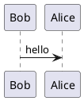
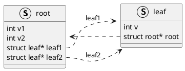

## PlantUML使用

### 安装

```bash
sudo apt install plantuml
```

### 使用

源码文件`demo.puml`




图片生成命令。

```bash
# 生成png文件
plantuml -tpng demo.puml
# 生成svg文件
plantuml -tsvg demo.puml
# 生成txt文件
plantuml -ttxt demo.puml
```


执行后，会在本地生成相应尾缀的图片文件。

### 数据结构图关系图



执行图片生成命令之后，可以生成对应的数据结构图.


### 参考资料

* [plantUML官网](https://plantuml.com/)
