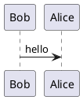
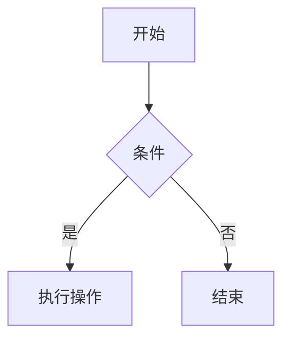

## vim-instant-markdown

### 安装

```vim
Plug 'suan/vim-instant-markdown',{'for':'markdown'}
```

```bash
sudo apt    install npm
sudo npm -g install instant-markdown-d
```

### 配置

```vim
let g:instant_markdown_mathjax = 1
let g:instant_markdown_mermaid = 1
let g:instant_markdown_theme = 'light'

"预览开启or关闭
nnoremap <silent> <F5> :InstantMarkdownPreview<CR>
nnoremap <silent> <F6> :InstantMarkdownStop<CR>
```

### 使用

#### plantUML支持



#### mermaid支持

`mermaid` 是专门为`markdown` 设计的轻量级图标工具。



#### latex支持

$$
E = mc^2
$$

#### dot支持


## markdown-preview

### 安装

```vim
Bundle 'iamcco/markdown-preview.vim'
```

### 使用

```bash
 # 开启预览
 :MarkdownPreview
 # 关闭预览
 :MarkdownPreviewStop
```
